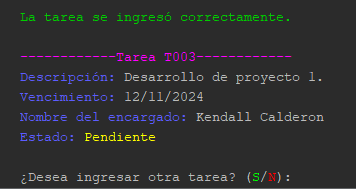
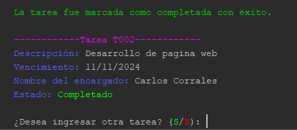

# TaskManagerJava

Este proyecto es una aplicación de consola desarrollada en Java como parte del curso de Programación Avanzada. Es mi primer proyecto en Java y ha sido una excelente oportunidad para aprender y aplicar conceptos básicos del lenguaje. La aplicación permite gestionar tareas mediante una interfaz sencilla en la terminal, ofreciendo diversas funcionalidades para la administración de tareas.

## Descripción del Proyecto

El sistema de manejo de tareas incluye las siguientes funcionalidades:

1. **Agregar Tareas:** Permite al usuario ingresar la descripción de la tarea, la fecha de vencimiento, el nombre del encargado, el apellido, y muestra los datos de la tarea.

3. **Ver Tareas:** Muestra una lista de todas las tareas ingresadas.

5. **Marcar Tareas como Completadas:** Permite marcar tareas como completadas.

7. **Eliminar Tareas:** Permite eliminar tareas de la lista.
8. **Filtrar Tareas:** Permite filtrar las tareas por estado o por fecha de vencimiento.

También puedes ver el [Video Demostración](Demostración/Demo.mp4) completa.

## Tecnologías Utilizadas

- **Lenguaje:** Java
- **Entorno de Desarrollo:** NetBeans

## Instalación y Uso

1. Clona el repositorio en tu máquina local.
2. Abre el proyecto en NetBeans.
3. Ejecuta la aplicación desde la consola de NetBeans para interactuar con el sistema de manejo de tareas.

## Notas

- Este es mi primer proyecto en Java, y aunque es una aplicación básica, he aplicado un diseño ordenado con colores para mejorar la experiencia del usuario en la consola.
- La aplicación es de consola y se ejecuta únicamente en el entorno de NetBeans.

Para más detalles sobre el desarrollo y la estructura del código, consulta los archivos y comentarios dentro del repositorio.

**Nota:** Este proyecto se realizó como parte del curso de Programación Avanzada y está en una fase inicial de desarrollo. Se recomienda revisar la documentación y los comentarios en el código para una comprensión completa del sistema.
